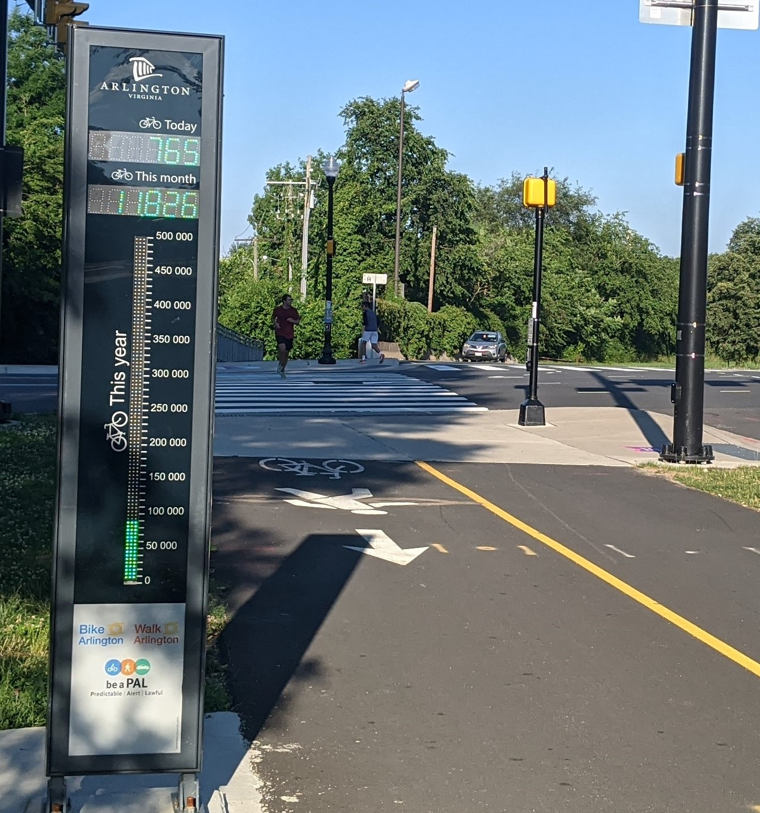
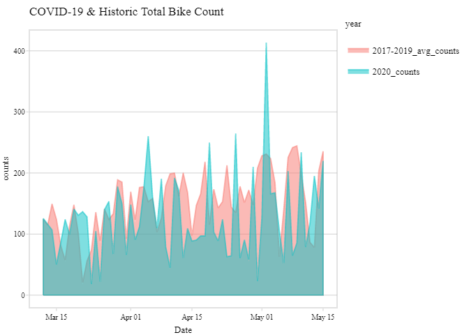

# BikeArlingtonPy
 
## Introduction

The Official [Bike Arlington](http://counters.bikearlington.com/data-for-developers/) API is accessed through [this URL](http://webservices.commuterpage.com/counters.cfc?wsdl) with multiple endpoints/methods to get everything from the number of bikers or pedestrians passing a Bikeometer that day, longitude/latitude of each Bikeometer, to the weather that day.

I've created these scripts for a multi-part project [Visualizing Arlington's Covid-19 Biking Trends](https://nathansprojects.com/part_1_the_plan.html) that I've posted online. The project outlines all the necessary information to go from zero to creating visualizations in R with data from your local MySQL database.

## Using the module

Before you use the module, you need to setup your MySQL database, which is [Part 3 of my 'Visualizing Arlington's Covid-19 Biking Trends' project](https://nathansprojects.com/part_3_setup_your_database.html).

Generally, the functions in BikeArlingtonPy will perform variations on 4 actions:

1.  Queries the Bike Arlington API for the details requested
2.  Isolates and cleans the data
3.  Moves the data into a pandas data frame
4.  Moves the data into a local MySQL database

## The functions

**all_counts_by_date_to_sql()**

Queries the Bike Arlington API to pull all counts by **day**. Hardcoded start date that represents the first datapoint in the Bike Arlington API. Data is parsed, cleaned, and converted to a dataframe with defined columns. Dataframe is then uploaded to MySQL Database.

**all_counts_by_hour_to_sql()**

Queries the Bike Arlington API to pull all counts by **hour**. Hardcoded start date that represents the first datapoint in the Bike Arlington API. Data is parsed, cleaned, and converted to a dataframe with defined columns. Dataframe is then uploaded to MySQL Database.    

**new_counts_by_hour_to_sql()**

Queries your database to find the most recent date uploaded. Uses the most recent date to query the Bike Arlington API to pull all **hourly** counts until yesterday. Data is parsed, cleaned, and converted to a dataframe with defined columns. Dataframe is uploaded to MySQL Database.

**new_counts_by_day_to_sql()**

Queries your database to find the most recent date uploaded. Uses the most recent date to query the Bike Arlington API to pull all **daily** counts until yesterday. Data is parsed, cleaned, and converted to a dataframe with defined columns. Dataframe is uploaded to MySQL Database.

**bikeometer_to_sql()**

Makes a GET request to the Bike Arlington API using the GetAllCounters method as a parameter. The API returns a response object that is first converted to a string, cleaned, and converted to an XML object. The XML object is then parsed for the relevant information, and added to a list. Each list, representing a Bikeometer, is converted to a tuple and added to a final list which can easily be saved to a csv or dataframe using the above functions.